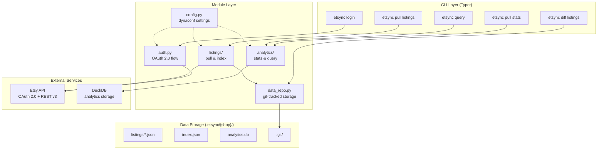

# etsync

CLI tool for managing your Etsy shop data locally. Pull listings from the Etsy API, store them as JSON files.

## Install

```bash
uv sync
```

## Setup

1. Create an Etsy API app at https://www.etsy.com/developers/your-apps and grab your API keystring.

2. Create `.secrets.toml` (never commit this):
```toml
[default]
api_keystring = "YOUR_API_KEY"
shop_id = 12345678
```

3. Authenticate:

```bash
etsync login
```

## Usage

```bash
etsync pull listings    # download all active listings as JSON
etsync pull stats       # snapshot listing stats into DuckDB
etsync diff listings    # show changes since last sync
etsync query "SQL"      # query the analytics database
```

Listings are saved to `.etsync/{shop_name}/listings/` in the project directory. Each sync is auto-committed to a local git repo for change tracking.

## Architecture



## Data Directory

```
.etsync/{shop_name}/
├── listings/
│   ├── {listing_id}.json
│   ├── index.json
│   └── ...
├── analytics.db
└── .git/              # auto-managed, tracks sync history
```

## Multi-shop

Set `ETSYNC_ENV` to switch between shop configs:

```bash
ETSYNC_ENV=shop2 etsync pull listings
```

Define per-shop settings in `.secrets.toml`:
```toml
[default]
api_keystring = "KEY1"
shop_id = 111

[shop2]
api_keystring = "KEY2"
shop_id = 222
```
