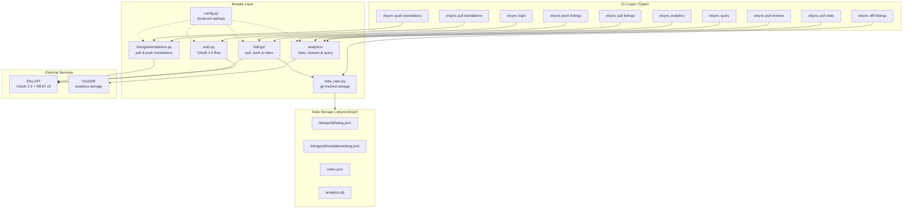

# etsync

CLI tool for scriptable Etsy shop management. Pull/push listings, translations, and analytics via the Etsy REST API. Data stored locally as JSON.

## Install

```bash
uv sync
```

## Setup

1. Create an Etsy API app at https://www.etsy.com/developers/your-apps and grab your API keystring.

2. Create `.secrets.toml` (never commit this):
```toml
[default]
api_keystring = "YOUR_API_KEY"
shared_secret = "YOUR_SHARED_SECRET"
shop_id = 12345678
```

3. Configure translation languages in `settings.toml` (optional):
```toml
[default]
languages = ["de", "fr", "es", "it", "nl", "ja"]
```

4. Authenticate:
```bash
uv run etsync login
```

## Usage

All commands run through `uv run`:

### Pull data from Etsy

```bash
uv run etsync pull listings                    # download all active listings as JSON
uv run etsync pull listings --with-translations # listings + all translation files
uv run etsync pull translations                # pull translations only (all listings)
uv run etsync pull translations --id 1234567   # pull translations for one listing
uv run etsync pull stats                       # snapshot listing stats into DuckDB
uv run etsync pull reviews                     # pull shop reviews into DuckDB
```

### Push local changes to Etsy

```bash
uv run etsync push listings --dry-run          # preview listing changes (diff only)
uv run etsync push listings                    # push modified listings
uv run etsync push listings --id 1234567       # push a single listing

uv run etsync push translations --dry-run      # preview translation changes
uv run etsync push translations                # push all modified translations
uv run etsync push translations --id 1234567   # push translations for one listing
```

Push commands compare local files against remote and only send modified fields.

### Diff and analytics

```bash
uv run etsync diff listings                    # show changes since last sync
uv run etsync query "SELECT * FROM stats"      # run SQL against analytics DuckDB
uv run etsync analytics top-listings           # top performing listings
uv run etsync analytics revenue                # monthly revenue summary
uv run etsync analytics reviews                # review summary and distribution
uv run etsync analytics sales                  # sales per listing
```

## Architecture



## Data Directory

```
.etsync/{shop_name}/
├── listings/
│   ├── index.json
│   ├── {listing_id}/
│   │   ├── listing.json
│   │   └── translations/
│   │       ├── de.json
│   │       ├── fr.json
│   │       └── ...
│   └── ...
├── analytics.db
└── .git/              # auto-managed, tracks sync history
```

## Useful Analytics Queries

All queries run via `uv run etsync query "SQL"`. Set `ETSYNC_ENV=shopname` for multi-shop.

### Tables

| Table | Contents |
|-------|----------|
| `listing_snapshots` | Daily listing stats: views, favorites, price, tags, taxonomy |
| `shop_snapshots` | Shop-level metrics: num_listings, num_favorers |
| `transactions` | Individual item sales with price, quantity, listing_id |
| `receipts` | Orders with buyer_country, totals, shipping, tax, status |
| `ledger_entries` | Financial ledger: fees, deposits, refunds |
| `revenue_summary` | Aggregated revenue by period |
| `reviews` | Shop reviews with rating, text, language, listing_id |
| `ad_campaign_snapshots` | Campaign-level ad metrics: views, clicks, orders, spend, ROAS |
| `ad_listing_snapshots` | Per-listing ad performance: ad views, clicks, orders, revenue |
| `ad_keywords` | Keyword-level ad data: ROAS, orders, spend, revenue, click rate |

### Top performers (views + sales + revenue)

```sql
SELECT
  ls.listing_id,
  ls.title,
  ls.views,
  ls.favorites,
  ROUND(ls.favorites * 100.0 / NULLIF(ls.views, 0), 2) AS fav_rate_pct,
  COALESCE(t.sales, 0) AS sales,
  COALESCE(t.revenue, 0) AS revenue
FROM listing_snapshots ls
LEFT JOIN (
  SELECT listing_id, COUNT(*) AS sales, SUM(price_amount) / 100.0 AS revenue
  FROM transactions GROUP BY listing_id
) t ON ls.listing_id = t.listing_id
WHERE ls.snapshot_date = (SELECT MAX(snapshot_date) FROM listing_snapshots)
ORDER BY t.revenue DESC NULLS LAST;
```

### Conversion rate (views to sales)

```sql
SELECT
  ls.listing_id,
  ls.title,
  ls.views,
  COALESCE(t.sales, 0) AS sales,
  ROUND(COALESCE(t.sales, 0) * 100.0 / NULLIF(ls.views, 0), 2) AS conv_rate_pct
FROM listing_snapshots ls
LEFT JOIN (
  SELECT listing_id, COUNT(*) AS sales FROM transactions GROUP BY listing_id
) t ON ls.listing_id = t.listing_id
WHERE ls.snapshot_date = (SELECT MAX(snapshot_date) FROM listing_snapshots)
ORDER BY conv_rate_pct DESC NULLS LAST;
```

### Sales by buyer country

```sql
SELECT buyer_country, COUNT(*) AS orders, SUM(grandtotal_amount) / 100.0 AS total
FROM receipts GROUP BY buyer_country ORDER BY orders DESC;
```

### Revenue by month

```sql
SELECT
  DATE_TRUNC('month', create_timestamp) AS month,
  COUNT(*) AS transactions,
  SUM(price_amount) / 100.0 AS revenue
FROM transactions
GROUP BY month ORDER BY month;
```

### Review distribution

```sql
SELECT rating, COUNT(*) AS count FROM reviews GROUP BY rating ORDER BY rating DESC;
```

### Listings with no sales (candidates for rework)

```sql
SELECT ls.listing_id, ls.title, ls.views, ls.favorites, ls.price_amount
FROM listing_snapshots ls
LEFT JOIN transactions t ON ls.listing_id = t.listing_id
WHERE ls.snapshot_date = (SELECT MAX(snapshot_date) FROM listing_snapshots)
  AND t.listing_id IS NULL
ORDER BY ls.views DESC;
```

### Views trend over time (per listing)

```sql
SELECT snapshot_date, listing_id, title, views, favorites
FROM listing_snapshots
ORDER BY listing_id, snapshot_date;
```

### Fee breakdown from ledger

```sql
SELECT entry_type, COUNT(*) AS entries, SUM(amount) / 100.0 AS total
FROM ledger_entries GROUP BY entry_type ORDER BY total;
```

## Multi-shop

Set `ETSYNC_ENV` to switch between shop configs:

```bash
ETSYNC_ENV=shop2 uv run etsync pull listings
```

Define per-shop settings in `.secrets.toml`:
```toml
[default]
api_keystring = "KEY1"
shop_id = 111

[shop2]
api_keystring = "KEY2"
shop_id = 222
```
